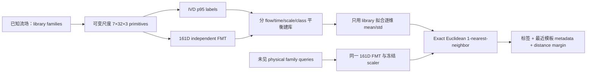

# Pathline Template Matching：项目总览

## 1. 最根本的研究问题

给定多个已知三维流场，我们从涡区域和非涡区域采集大量 pathline primitive，用已加载空间体的瞬时涡量偏差第 95 百分位（whole-loaded-volume Instantaneous Vorticity Deviation p95，IVD p95）产生二分类标签，再用无可训练参数的 FMT 生成特征库。FMT 沿用原项目名称；由于原文档存在不同历史全称，本项目不展开该缩写。

面对一个未参与建库、方法选择或阈值选择的新流场，同样把 query primitive 编码成特征，检索库中欧氏距离最近的模板，并继承其涡/非涡标签。

本项目要回答的不是“FMT 能否进入分类网络”，而是：

> 在明确冻结的流场 family、邻居距离、积分步长和积分总长度范围内，training-free FMT 特征空间中的最近模板，能否可靠地代表同一种局部流动模式？

## 2. 与 FMT 项目的关系

FMT 项目提供三个已验证的基础部件：

1. 三维 primitive 固定为中心线及 `x±、y±、z±` 六邻居，共 7 条线；各线积分后采样为 32 点。
2. 无可训练参数的三维 Fourier 描述符及其刚体平移、固定旋转不变性测试。
3. Task5 的可变尺度构造：邻居距离、Runge–Kutta fourth-order method（RK4，四阶龙格–库塔积分）的步长和积分步数可变，但网络输入固定为 `7×32×3`。

FMT Task5 的 `mainExp_Task5_3D_1.1` 在 10 个数据条目上支持“FMT 改善可变尺度监督 IVD 分类”，其相对同维 Raw Principal Component Analysis（PCA，主成分分析）residual 的 dataset-macro F1/Average Precision 增益为 `+.0891/+.1116`。这只是新项目的动机证据，不能当作最近邻模式匹配的结果。来源与适用边界见 [source_provenance.md](source_provenance.md)。

## 3. 冻结的数据契约

### 3.1 Primitive

- 3D 线顺序固定为 `center, x+, x−, y+, y−, z+, z−`。
- 每个 seed 分配一个尺度 tuple：`(offset_grid_scale, dt_scale, integration_steps)`。
- 线数固定为 7，每线采样点数固定为 32。积分器输出 `7×32×4=(x,y,z,t)`；描述符只读取 `7×32×3=(x,y,z)`，时间仅用于物理时间与重采样审计。
- `mainExp_TemplateMatching_1.1` 沿用 FMT Task5 的 rounded-integration-index 采样。物理时间线性插值和弧长插值必须先使用新的 `Verify_...`；若验证后成为论文主方法，还必须升级 `mainExp_TemplateMatching_x.y`，不能替换 1.1 的结果。
- 当前 FMT 基线的六个邻居共享一个距离。若未来允许六个距离分别变化，必须升方法版本并增加 config 字段和测试。

### 3.2 标签

在 primitive 的 seed time 上计算

```text
ω(x,t) = curl(v(x,t))
IVD(x,t) = ||ω(x,t) − mean_loaded_volume(ω(t))||
label(seed) = IVD(seed) >= percentile95(IVD volume)
```

这里的 “whole field” 实际指 loader 读取并可能按 stride 降采样后的完整空间体，不等于原始全分辨率数据。首版名称因此固定为 `whole_loaded_volume_ivd_p95`，避免混淆。

### 3.3 默认 FMT 描述符

`fmt_independent_3d_161d_sha256_25fce29499c9089e` 使用 6 个 Fourier 频率、Gram rotation invariants、chirality 和跨邻居逐槽排序，宽度为：

```text
每线: 6×3 Gram slots + 5 chirality slots = 23
中心和六邻居: 7×23 = 161
```

它没有可训练参数，也不读取同 batch 的其他 primitive，因此同一个 query 单独编码、混在任意 batch 中编码或分 chunk 编码必须逐位一致。`neighbor_weight=1`、`neighbor_scale=1` 与旧 Task5 cache 的生成代码一致；改动任一参数都会产生新的内容派生 descriptor ID，不能与旧 cache 混检索。

FMT Task5 的主 268 维配方由 `161D base + 63D time-local Gram + 44D kinematic` 拼接。44 维 kinematic 块用当前 batch 的平均涡量；同一 query 会因 batch 组成改变。它不进入本项目首版主基线。

## 4. 首个模式匹配基线



基础方法参数位于 [config/mainExp_TemplateMatching_1.1.yaml](../config/mainExp_TemplateMatching_1.1.yaml)；已暴露旧 Task5 cache 的 development 运行协议位于 [config/mainExp_TemplateMatching_1.1_development.yaml](../config/mainExp_TemplateMatching_1.1_development.yaml)。Development evaluator、统计汇总和三联图已经实现；完整主实验仍未冻结，因为新的 sealed confirmation manifest、raw-field builder 和置信区间结论规则仍缺失。

- 模板库在每个 `flow × source time × scale tuple` 取 `m=min(512,n_positive,n_negative)` 个正类和负类；任一类为空则失败并登记。
- 标准化的均值和标准差只从 library feature 拟合；query 不得更新它们。
- 匹配器是精确欧氏一最近邻。二分类连续分数为 `最近负类距离 − 最近正类距离`；分数大于零等价于最近模板属于正类。
- 1.1 不启用 unknown/reject threshold。拒识属于后续独立版本。
- 主对照包含 672 维 centered Raw、只在 library 拟合的 161 维 Raw-PCA、161 维 FMT，以及只用未平衡 library 候选标签比例的常数 prior。所有检索对照使用各自 library-only preprocessing 和相同 exact one-nearest-neighbor。

## 5. 数据拆分与证据等级

旧 FMT 的 10 个数据条目和全部 Task5 scale tuple 已被开发过程查看过，只能作为本项目 development 资源，不能称为全项目未见 confirmation。

开发评测采用 leave-one-physical-family-out：每次把一个完整 physical family 作为 query，其余 family 建库。正式 confirmation 必须来自新的 flow family；在完整方法、代码 commit 和 manifest 冻结前，不得读取其 raw field、query feature、有效率、标签或指标。

旧 cache 的 4 个 train-scale source times 用于建库及“未见 family、已见尺度”查询；2 个 validation-scale times 只允许进入 `Verify_...` 方法选择；历史 confirmation-scale times 用于“未见 family、未见尺度”的 development 查询。两类结果必须分开报告。

每折 query 使用留出 family 和对应 evaluation scale set 的全部 valid primitives，保持自然类别比例，不按标签平衡或下采样；必须报告 assigned、valid、invalid 和自然正负类数量。

必须同时防止三种泄漏：

1. 同一 physical family 跨 library/query；
2. 同一 pathline 的完整 source window 跨拆分；
3. 同一 scale tuple 在“未见尺度”实验中换名后跨拆分。

## 6. 评价方式

主要指标：Average Precision（AP，按连续分数衡量正类排序）和 F1。辅助指标：Area Under the Receiver Operating Characteristic Curve（AUROC，受试者工作特征曲线下面积）、precision、recall、balanced accuracy。

所有结果都要给出：逐 flow、dataset macro、physical-family macro、逐尺度 tuple，以及按 source timeslice 配对 bootstrap 的 95% confidence interval（置信区间）。不能只报告 primitive-level 随机 bootstrap，因为同一时间片内样本相关。

## 7. 当前代码边界

已经迁移并测试：

- 独立 161 维 FMT descriptor；
- 尺度 tuple 校验与均衡分配；
- fail-closed NetCDF window loader；
- whole-loaded-volume IVD；
- 精简后的三维 RK4、7-line primitive 构造和 rounded-index `7×32×4=(x,y,z,t)` 重采样；FMT view 为前三通道 `7×32×3`，并通过常速度解析解与零速度多尺度测试；
- library-only standardization、精确 1NN、class-distance margin、无 pickle 保存；
- cache-backed 七个 physical family leave-one-out evaluator、四方法对照、逐 query/timeslice/flow/family/scale 表、成对 bootstrap、反例表和哈希链；
- 每个 flow 的 seen/unseen-scale 三联图：IVD-p95+pathlines、FMT template class assignment、TP/FP/FN/TN；
- Ibex 原始数据与旧 Task5 cache 的区分验证脚本。

尚未实现，因此即使 cache-backed development job 完成，也不能宣称已完成 formal confirmation 或整个主实验：

- 面向新 raw flow 的正式 primitive/cache builder；
- seed-time IVD 插值；
- sealed confirmation manifest、first-read gate 和 evaluator gate；
- 新 flow family 的 sealed confirmation 数据。

这些应按 [experiment_log.md](experiment_log.md) 中的版本顺序实施，不能直接在旧 confirmation 上调参。

## 8. 文档权威顺序

各文档职责不能互相替代：[research_tasks_and_protocol.md](research_tasks_and_protocol.md) 管研究与泄漏规则；具体版本文档和 config 管该版本方法；[experiment_log.md](experiment_log.md) 管当前结论及修订；[ibex_run_registry.md](ibex_run_registry.md) 管逐 job 原始证据；本 overview 和 README 只负责导航。若同一事项冲突，先停止实验并在这些文件中显式修订，不能静默选一个版本继续。
